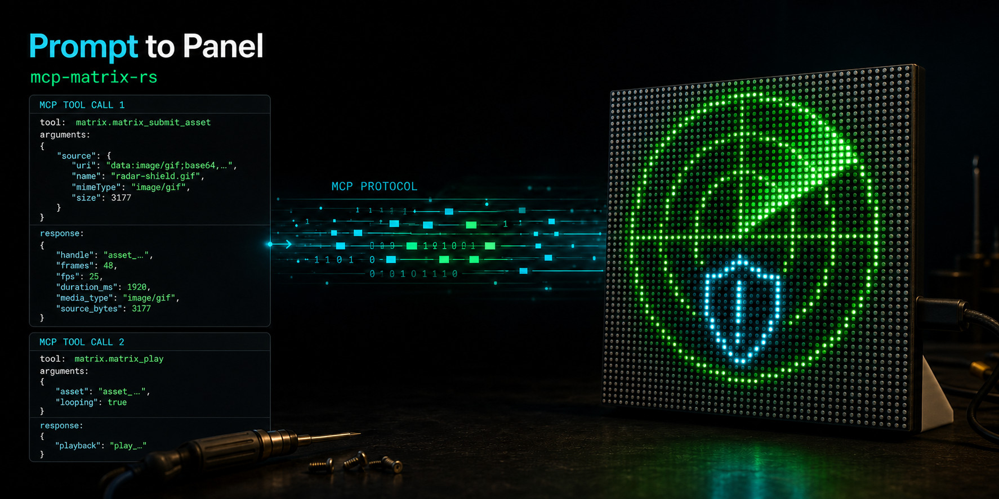
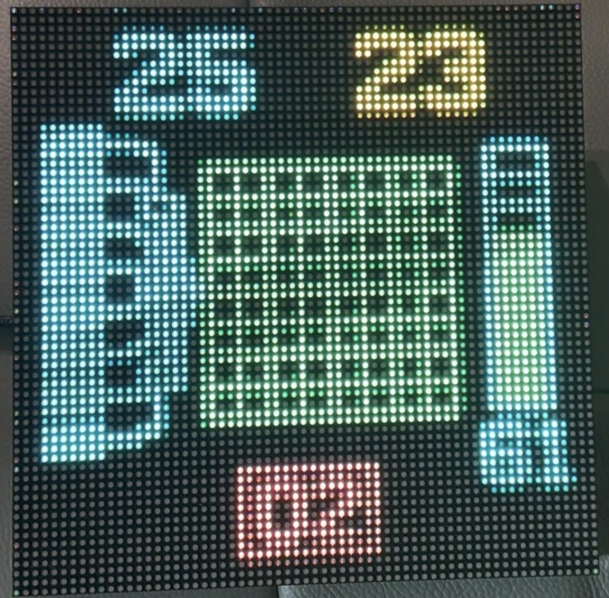

# mcp-matrix-rs

[](https://github.com/chrisbennight/mcp-matrix-rs/actions/workflows/test.yml)
[](https://github.com/chrisbennight/mcp-matrix-rs/actions/workflows/image.yml)
[](LICENSE)
[](https://github.com/chrisbennight/mcp-matrix-rs/releases)

https://github.com/user-attachments/assets/c8defe74-9c04-490e-9b0b-457122f0d38e

An agent built and played the radar loop above from one prompt.

<details>
<summary>The prompt that created it</summary>

> Grab the last 10 minutes of security alerts from the Sentinel MCP and put something cool on the matrix with them. Maybe a radar with a shield in the middle, green blips for normal activity, yellow for anything suspicious, and red for critical alerts. When the sweep hits a critical one, flash the shield red. Make it loop and send it to the display.

</details>

`mcp-matrix-rs` turns a WLED-driven RGB matrix into an MCP display. It renders text
and small inline media into fixed-rate RGB frames, applies a panel power budget, and
streams the result over DDP.

The verified target is the Apollo Automation M-1: a 64x64 HUB75 panel running WLED.
Other WLED RGB matrices may work, but the electrical model is calibrated for that
hardware; see [Compatibility](docs/compatibility.md) before using another panel.

## Why

WLED can already run built-in effects, and tools like xLights or LedFx can stream pixels to it. What none of that provides is a safe way for an AI agent to put arbitrary content on the panel: something has to rasterize text, decode untrusted media inside hard limits, pace frames to the rate the panel actually achieves, and keep the output inside the panel's power budget.

`mcp-matrix-rs` is that layer. It gives any MCP client a physical display it can drive with a tool call, while the server owns normalization, rate adaptation, and power clamping. The caller never touches raw frames or the device.

## Examples

Everything below is the physical panel, photographed or filmed. Each example was produced by an agent from the prompt shown with it; the service names in the prompts are fictional.

### Package delivery marquee

The simplest path: the agent read a number from another MCP server and passed a line of text to `matrix_show_text`. No image or video was generated by the caller; the scrolling marquee is the server's native bitmap font.

https://github.com/user-attachments/assets/a3ece4cd-ab60-469b-8c57-fdfc8919a178

<details>
<summary>The prompt that created it</summary>

> Check the Parcel MCP and see how many packages are arriving today. Put `Packages: N` on the matrix with the real count and let it scroll.

</details>

### Playout telemetry

A dashboard-style still: requested versus achieved frame rate, queued frames flowing into the renderer, a load gauge, and a dropped-frame count, all legible at 64x64.



<details>
<summary>The prompt that created it</summary>

> Grab the last few minutes of frame delivery stats from RenderPulse and put something useful on the matrix. I'm thinking requested vs actual FPS, how full the queue is, maybe a little view of frames moving through the renderer, load percentage, and dropped frames if there are any. Make it feel like a tiny live ops display, mostly cyan and green with yellow or red when something's off. Keep the numbers chunky enough to read on the panel, then send it over and leave it running.

</details>

### P1 security incident

An alert screen readable from across the room: incident header and count, affected host, MITRE technique, recent-activity graph, and an acknowledgement bar.


<details>
<summary>The prompt that created it</summary>

> Check Nightwatch for the highest priority security alert from the last 15 minutes. If there's a P1, turn it into something I can see from across the room on the matrix. Big security header, alert count, affected host, MITRE code, a small recent-activity graph, and an ACK area at the bottom. Red and cyan, big readable text. Send it to the display when it's ready. If there isn't a P1, just use the highest severity alert you find.

</details>

## What works

- MCP `2026-07-28` over Streamable HTTP at `/mcp`, or over stdio (`--stdio`) for
  clients without remote MCP support
- centered and scrolling text; input is capped at 100 characters, and long marquees
  must also fit the configured frame budget
- multi-region text layouts: up to 16 non-overlapping rectangles of fixed or
  scrolling text composed into one animated package; a scroller can cross once or
  `repeat` with a `phase` offset, so regions animate continuously and appear to
  loop independently
- PNG, GIF, and video normalization through isolated FFmpeg subprocesses
- fixed-rate playout with feedback from WLED's reported frame rate
- software power clamping before frames reach the panel
- power, brightness, playback, asset, status, and device tools

Media submitted in a tool argument is limited to a 16 KiB base64 `data:` URI, which fits
text and native-resolution still images. Anything needing a downscale — a GIF or a video
— is by definition larger, and reaches the panel through the transfer plane instead: a
trusted intermediary obtains a single-use upload authorization, streams the media to this
server directly, and a later `matrix_submit_asset` names the result. The bytes never
appear in a tool argument or in model context.

That plane is off unless `MATRIX_FILE_PUBLIC_URL` names the public origin this server is
reached at; unset, the server is inline-only exactly as before. It requires the HTTP
transport, and the origin should be the one `/mcp` is already served on. See
[configuration](docs/configuration.md#the-transfer-plane) and
[deployment](docs/deployment.md#file-staging).

This server never fetches a destination a caller named, whether or not the plane is
configured.

## Status and non-goals

This is an early release, verified on one panel model, and maintained as a personal project. Review [PLAN.md](PLAN.md) before depending on behaviour that is not in a tagged release.

Deliberate non-goals: the server does not authenticate clients (operators own that boundary), does not fetch caller-supplied URLs, and does not claim support for panels beyond the verified hardware. The reasoning is recorded in [DECISIONS.md](DECISIONS.md).

## Quick start

You need Docker, Docker Compose, and a WLED device reachable from the Docker host by
HTTP and UDP. Configure WLED to accept DDP on UDP port 4048, retain a bounded realtime
timeout, and set an appropriate power ceiling before sending frames.

```sh
cp .env.example .env
# Edit .env and replace the documentation-only panel address.
docker compose -f compose.example.yml up --build
curl --fail http://127.0.0.1:8080/healthz
```

Connect an MCP client to `http://127.0.0.1:8080/mcp`, then call
`matrix_describe_device` before displaying content. The example publishes the service
on loopback only.

The server has no built-in authentication. Do not expose it directly to the internet
or an untrusted LAN. See [Deployment and security](docs/deployment.md) before changing
the listener or published-port address.

If your MCP client cannot connect to a remote server at all, skip the container and
run the binary over stdio instead; see [stdio](#stdio) under Usage.

## Usage

The server speaks two transports: Streamable HTTP (the default, one shared server for
any number of clients) and stdio (`--stdio`, for clients that spawn a local process
instead of connecting to a URL). The tool surface is identical on both.

### Streamable HTTP

Point any MCP client that speaks Streamable HTTP at `http://127.0.0.1:8080/mcp`.
For Claude Code:

```sh
claude mcp add --transport http matrix http://127.0.0.1:8080/mcp
```

For Codex, in `~/.codex/config.toml`:

```toml
[mcp_servers.matrix]
url = "http://127.0.0.1:8080/mcp"
```

or in a client's generic JSON configuration:

```json
{
  "mcpServers": {
    "matrix": { "type": "http", "url": "http://127.0.0.1:8080/mcp" }
  }
}
```

### stdio

Build or install the `matrix-server` binary on the client machine, then register it as
a spawned server. The client owns the process: it starts the server on demand and the
server exits when the client closes the pipe. Each stdio process assumes it is the
panel's only driver, so run one stdio client per panel and do not mix it with a
concurrently running HTTP instance.

For Claude Code:

```sh
claude mcp add matrix \
  --env MATRIX_WLED_URL=http://192.0.2.10 \
  --env MATRIX_DDP_ADDR=192.0.2.10:4048 \
  -- matrix-server --stdio
```

For Codex, in `~/.codex/config.toml`:

```toml
[mcp_servers.matrix]
command = "matrix-server"
args = ["--stdio"]

[mcp_servers.matrix.env]
MATRIX_WLED_URL = "http://192.0.2.10"
MATRIX_DDP_ADDR = "192.0.2.10:4048"
```

Replace the documentation-only `192.0.2.10` with your panel's address. Every setting
in the [configuration reference](docs/configuration.md) works as an environment
variable or a flag; `MATRIX_HTTP_ADDR` and `MATRIX_ALLOWED_HOSTS` are HTTP-only and
ignored under `--stdio`, and combining `--stdio` with `--healthcheck` is rejected at
startup. Logs go to stderr, so client transcripts stay clean JSON-RPC.

### A typical session

A typical session from the client:

1. `matrix_describe_device` — confirm the panel's identity, dimensions, and power
   headroom before displaying content.
2. `matrix_show_text` with `{"text": "HELLO"}` — text that fits shows as a centered
   still; longer text scrolls as a marquee until stopped.
3. `matrix_submit_asset` with a base64 `data:` URI (16 KiB limit) or with a reference
   staged through the transfer plane, then `matrix_play` with the returned asset handle.
   Either can be written as a bare URI string or as an object carrying that URI, and all
   four combinations return the same report.
4. `matrix_stop` — the panel returns to its configured ambient behaviour.

### Tools

| Tool | Purpose |
| --- | --- |
| `matrix_describe_device` | Panel identity, firmware, dimensions, achieved framerate, and power draw |
| `matrix_status` | What is playing, how many assets are held, last reported framerate |
| `matrix_submit_asset` | Normalize media into frames and hold it; returns an asset handle |
| `matrix_list_assets` | List the assets currently held |
| `matrix_play` | Play a held asset, replacing whatever was playing |
| `matrix_show_text` | Centered still or scrolling marquee text |
| `matrix_show_text_layout` | Fixed and scrolling text regions composed into one animated package |
| `matrix_stop` | Stop playback; the panel returns to ambient behaviour |
| `matrix_set_brightness` | Set panel brightness, 0 to 255 |
| `matrix_power` | Turn the panel on or off |

## Configuration and support

- [Configuration reference](docs/configuration.md)
- [Deployment and security](docs/deployment.md)
- [Hardware and platform compatibility](docs/compatibility.md)
- [Design decisions](DECISIONS.md)
- [Roadmap and architecture](PLAN.md)

## Development

The workspace uses the toolchain pinned in `rust-toolchain.toml`.

Current crate organization/purpose:

| Crate | Purpose |
| --- | --- |
| `matrix-frame` | Canvas geometry and the fixed-rate frame representation; no I/O or device knowledge |
| `matrix-device` | WLED JSON client for configuration and state, DDP transport for frames |
| `matrix-media` | Untrusted media decode and normalization, out of process under a deadline and limits |
| `matrix-playout` | Rate adaptation, power clamping, and paced sends; the only frame-send path |
| `matrix-text` | Rasterizing text into the shared frame representation |
| `matrix-server` | The binary: MCP transport, tool dispatch, and shared engine state |

```sh
cargo fmt --all -- --check
cargo clippy --workspace --all-targets --all-features --locked -- -D warnings
cargo test --workspace --all-features --locked
docker build -t mcp-matrix-rs:local .
```

Unit and integration tests use loopback fakes and never contact a real panel. See
[CONTRIBUTING.md](CONTRIBUTING.md) for the repository workflow.

Version tags publish matching versioned images to `ghcr.io/chrisbennight/mcp-matrix-rs`
(`v1.2.3` publishes `:1.2.3`). No mutable `latest` alias is published. The example
Compose file builds the checked-out revision locally.

## License

MIT. See [LICENSE](LICENSE).
